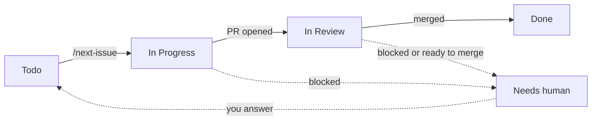

# skills

Alessandro Mangone's personal [Claude Code](https://claude.com/claude-code) skills marketplace: a growing collection of skills, built from scratch or adapted from real projects, published so they can be installed into any repository.

## Install

```
/plugin marketplace add anotherbuginthecode/skills
/plugin install anotherbuginthecode-skills@anotherbuginthecode
```

This installs every skill in the table below at once, each as
`/anotherbuginthecode-skills:<skill-name>` - see the "How to use" column for
the exact command and arguments.

## Repository structure

This repo keeps two trees, generated from one source of truth:

- **`skills/<category>/<skill-name>/`** - the source of truth. This is where skills are written and edited, organized by category for anyone browsing the repo.
- **`plugins/anotherbuginthecode-skills/`** and **`.claude-plugin/marketplace.json`** - generated. A Claude Code plugin marketplace requires each skill's `SKILL.md` to live under `<plugin-root>/skills/<skill-name>/SKILL.md`, which a two-level `skills/<category>/<skill-name>/` tree can't satisfy directly. `scripts/sync_plugins.py` bridges the two: it bundles every skill from `skills/` into the single `anotherbuginthecode-skills` plugin (one install gets everything, and every skill's slash command reads `/anotherbuginthecode-skills:<skill-name>`), and regenerates `marketplace.json` and the skills table below.

Never hand-edit `plugins/`, `.claude-plugin/marketplace.json`, or the table below - after adding, renaming, or editing a skill under `skills/`, run:

```
python3 scripts/sync_plugins.py
```

Skills under `skills/deprecated/` and `skills/in-progress/` are excluded from the sync - they stay in the repo but are never published as installable plugins.

## Available skills

<!-- SKILLS_TABLE:START - generated by scripts/sync_plugins.py, do not edit by hand -->

### Engineering

| Skill | Description | How to use |
| --- | --- | --- |
| `architecture` | Creates or updates root ARCHITECTURE.md from verified implementation. Use when a repository needs current architecture documentation or a structural change made it stale. Use design for proposed systems or changes. | `/anotherbuginthecode-skills:architecture [repository or existing ARCHITECTURE.md]` |
| `architecture-review` | Reviews a technical proposal before implementation. Use for designs, RFCs, ADRs, architecture proposals, and issues that define how a system change should work. Finds material ambiguity and flaws in correctness, scalability, performance, security, operations, and proof. | `/anotherbuginthecode-skills:architecture-review [technical proposal, design, RFC, ADR, or issue]` |
| `design` | Writes a proposed design covering requirements, user experience, technical choices, and proof. Use when important product or technical choices must be settled before coding. Use architecture to document an implemented system. | `/anotherbuginthecode-skills:design <feature, problem, or brief>` |
| `improve` | Makes existing code easier to understand without changing behavior. Use to simplify structure, remove duplication or dead code, improve names, or remove unnecessary abstractions. | `/anotherbuginthecode-skills:improve [code, files, diff, branch, or improvement focus]` |
| `new-project` | Bootstraps a new GitHub repository with the process structure this user's projects use to be managed autonomously by AI agents - .gitignore, issue/PR templates, AGENTS.md policy, PRODUCT.md skeleton, GitHub labels, a Projects v2 board, and committed .claude/settings.json. Invoked explicitly via /new-project, not triggered automatically. | `/anotherbuginthecode-skills:new-project [repo name, short project description]` |
| `next-issue` | Coordinates one iteration of the delivery loop: resumes or picks the next ready GitHub issue for an area, delivers it through /task-to-pr, applies the board's autonomy rules, and ends with a LOOP_STATUS line. Use to drive implementation one issue per fresh context. | `/anotherbuginthecode-skills:next-issue <area: infra\|backend\|frontend\|security\|docs>` |
| `plan` | Turns an approved design or decided brief into ordered tasks for separate agent runs. Use for implementation tasks, tracker tickets, or useful milestones. Do not use for one coding task or its short execution outline. | `/anotherbuginthecode-skills:plan <design, brief, issue, or request>` |
| `project-board` | Sets up issue organization for the current GitHub repository - explores the codebase to infer area labels (area:frontend, area:backend, area:ai, area:infra, ...), confirms the label set with the user, then creates the labels and a linked Projects v2 board (Todo -> In Progress -> In Review -> Needs human -> Done) with Board/Up next/My inbox/Supervised views. Invoked explicitly via /project-board, not triggered automatically. | `/anotherbuginthecode-skills:project-board` |
| `review` | Uses a fresh agent to review an implementation change without editing it. Checks behavior, security, regressions, complexity, tests, docs, and missing proof. Use for code, PR, diff, security, second-opinion, or pre-merge reviews. | `/anotherbuginthecode-skills:review [diff, branch, commit, PR, or file path]` |
| `task-to-pr` | Completes one or more tasks. Creates one tested and reviewed pull request for each task. Use to implement, build, fix, or deliver tasks, tickets, pull requests, or a milestone. | `/anotherbuginthecode-skills:task-to-pr <tasks, tickets, pull requests, or milestone>` |

<!-- SKILLS_TABLE:END -->

## Agentic workflow

Humans decide _what_ to build; agents build it one issue at a time. All state lives on GitHub (issues, PRs, board), so every session starts fresh.

### Quickstart

```
/new-project            # once: repo, templates, AGENTS.md
/project-board          # once: labels + board
/design <brief>         # settle the choices
/architecture-review    # challenge the design
/plan <design>          # create issues on the board
/next-issue backend     # then: /clear and repeat, per area
/architecture           # when the board is empty
```

### Issue lifecycle

Each issue has one `area:*` and one `autonomy:*` label (`auto` or `supervised`).



| Autonomy     | Agent                                                                              | You                                     |
| ------------ | ---------------------------------------------------------------------------------- | --------------------------------------- |
| `auto`       | Delivers and squash-merges after review approves and CI is green                   | Nothing                                 |
| `supervised` | Posts a plan and stops; after your approval, delivers and stops again before merge | Reply `Approved`, then review and merge |

Use `supervised` for auth, schema, migrations, paid or personal-data calls, security config, deployment, and API contract changes. Use `auto` for the rest.

### Rules

- `/clear` after every issue.
- Review runs in a fresh agent, never the author.
- PRs branch from `main` and merge one at a time. No stacking.
- A mistake made twice goes into `CLAUDE.md` Gotchas; a hard-to-reverse decision becomes an ADR.

## Citations

`architecture`, `architecture-review`, `design`, `improve`, `plan`, and `task-to-pr` are adapted from [owainlewis/blueprint](https://github.com/owainlewis/blueprint).
